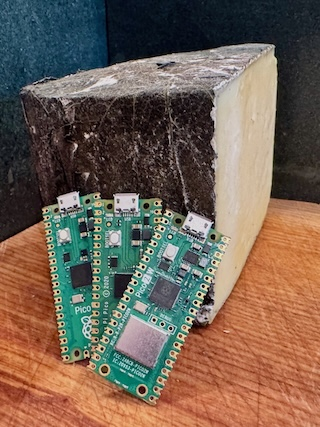

## Yarg Lang

Host of Yarg, a dynamic language for Micrcontroller firmware development.

  * Homepage: [yarg-lang.dev][homepage]
  * John's Newsletter: [yarg-lang.dev/notes][newsletter]

[homepage]: https://yarg-lang.dev/
[newsletter]: https://yarg-lang.dev/notes
